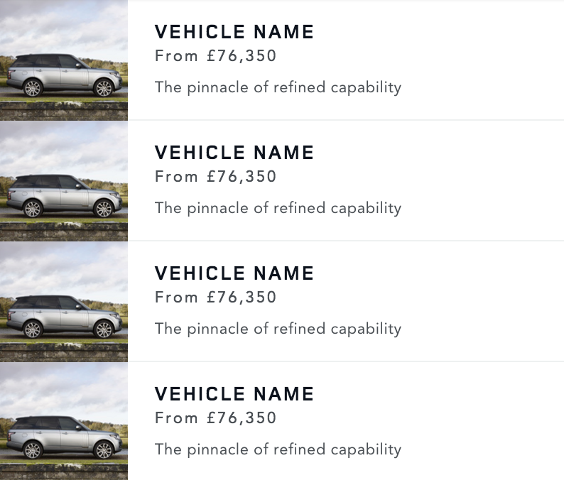

# Frontend Technical Test

## Made with 💚 by [João Rocha](mailto:joaorocha@gmail.com)

### ✅ Acceptance Criteria
We have a high focus on attention to details in code

* The formatting of the codebase should be consistent and written in a modular approach
* The solution should be structured appropriately for enterprise scale development
* We expect the data from the two API calls to be retrieved and merged efficiently using appropriate RxJS operators
* We expect the codebase to be written using ES6+ and libraries kept to a minimum
* We expect the code to be written with performance in mind
* We expect you to create an appropriate level of automated test coverage
* We expect to see a best practice approach to error handling
* We prefer native Browser Api over JS libraries
* Mobile-first development approach using min-width media queries
* Solution should be accessible and meet WCAG 2.1
* No CSS framework allowed
* Internally, we use BEM - but we are open to other CSS naming conventions as long as it's built with scale and maintenance in mind

We have a high focus on attention to details in design

* We expect the designs to match as closely as possible, ready for a designer to review
* Correct semantic HTML mark-up and/or CSS should be used to achieve the size and aspect ratio of the images in the design
* Interactions and animations to be considered but not distracting users away from the experience
* Minimal visual bugs when going resizing to mobile and large screen sizes

### 🖼️  Designs
#### Mobile breakpoint (<600px)

### 🎥 Video review 🍿
### [Click here to see the Video Review]([LINK_TO_LOOM_VIDEO]) 

## ✍️ Proposed Solution

- we can achieve the desired designs by breaking them in the following components:
  - CardComponent
  - CardListComponent
- CardService: to fetch data from the API 

*TODO: [ADD_SOLUTION_DESCRIPTION]*
- [other steps here]

### ➡️ [Click here to see the Live Demo]([LINK_TO_THE_DEPLOYED_APP]) ⬅️

## 📷 Screenshots

## Assumptions

*TODO: [ASSUMPTIONS_MADE_HERE]*

## 📚 Libraries / Tools Used 🔧

- Angular v17
- Angular CLI to create a new app 
- RxJS operators

## 💻 Setup

To install the dependencies run:

`npm install`

And to run the app:

`npm start`

## 🧪 Running the tests

You can run the unit tests using:

`npm test`

## 📈 Future Work

1. Complete test coverage to achieve 90%
2. Improve styling and responsive design
3. Test for perfomance and consider setting up a CDN
   ...
