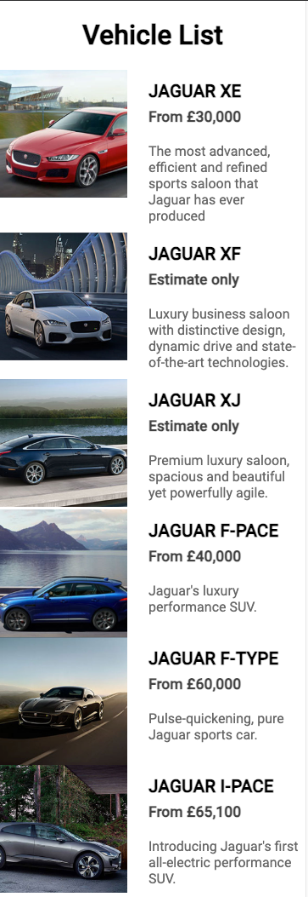
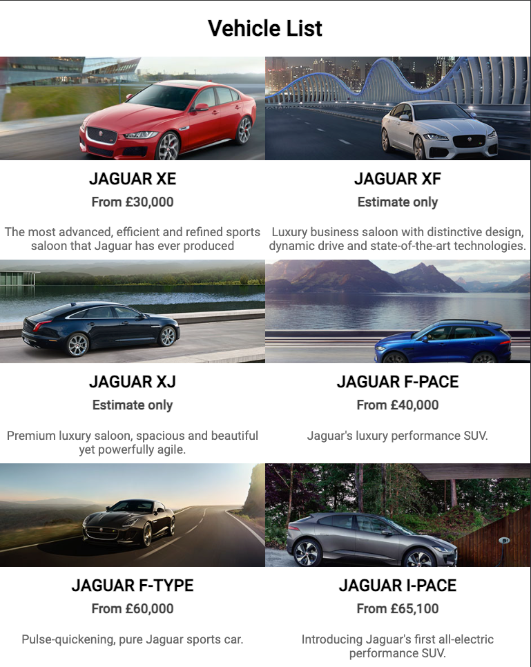

# Frontend Technical Test

## Made with 💚 by [João Rocha](mailto:joaorocha@gmail.com)

### ✅ Acceptance Criteria
We have a high focus on attention to details in code

* The formatting of the codebase should be consistent and written in a modular approach
* The solution should be structured appropriately for enterprise scale development
* We expect the data from the two API calls to be retrieved and merged efficiently using appropriate RxJS operators
* We expect the codebase to be written using ES6+ and libraries kept to a minimum
* We expect the code to be written with performance in mind
* We expect you to create an appropriate level of automated test coverage
* We expect to see a best practice approach to error handling
* We prefer native Browser Api over JS libraries
* Mobile-first development approach using min-width media queries
* Solution should be accessible and meet WCAG 2.1
* No CSS framework allowed
* Internally, we use BEM - but we are open to other CSS naming conventions as long as it's built with scale and maintenance in mind

We have a high focus on attention to details in design

* We expect the designs to match as closely as possible, ready for a designer to review
* Correct semantic HTML mark-up and/or CSS should be used to achieve the size and aspect ratio of the images in the design
* Interactions and animations to be considered but not distracting users away from the experience
* Minimal visual bugs when going resizing to mobile and large screen sizes

## 🎥 Video review 🍿

### ➡️ [Click here to open the Video ](https://www.loom.com/share/90196e0e687b4c8daba0d3b469ffb2fe) ⬅️ 

## ✍️ Proposed Solution

- We can achieve the desired designs by breaking them in the following elements:
  - Components:
    - `HomePageComponent`: renders the home page `/`
    - `VehicleListComponent`: is responsible for showing a list of `Vehicles`
    - `VehicleComponent`: is responsible for showing a single `Vehicle`
  - Services:
    - `VehicleService`: is responsible for fetching data from the API, by making HTTP requests


## 📷 Screenshots
### ➡️ [Open the app deployed on Netlify](https://frontend-code-by-joao-rocha.netlify.app/) ⬅️
### Mobile (375px)


### Tablet (768px)


### Desktop (1024px)


## 🔎 Lighthouse reports
### Mobile


### Desktop


## Assumptions

* Getting vehicle `problematic` should not break the app
* If we have an error fetching a vehicle (e.g.: `problematic`) we should remove it from `vehicles[]`, and not show it 
* We want to use the smaller image (1x1) in breakpoint SM, and use the bigger image (16x9) in breakpoints MD and LG 

## 📚 Libraries / Tools Used 🔧

- Angular v17
- Angular CLI to create a new app 
- RxJS operators
- Prettier

## 💻 Setup

To install the dependencies run:

```shell
npm install
```

To run the app:

```shell
npm start
```


## 🧪 Running the tests

You can run the unit tests using:
```shell
npm run test:coverage
```

### Test coverage:
```shell
=============================== Coverage summary ===============================
Statements   : 94.59% ( 35/37 )
Branches     : 71.42% ( 5/7 )
Functions    : 94.44% ( 17/18 )
Lines        : 94.44% ( 34/36 )
================================================================================
```


## 📈 Future Work

1. Fix image size and position in mobile breakpoint
2. Complete test coverage to achieve 90%
2. Improve styling and stylesheets organization (consider using [ITSCSS](https://developer.helpscout.com/seed/glossary/itcss/))
3. Improve performance in Mobile to be at least 80
   
